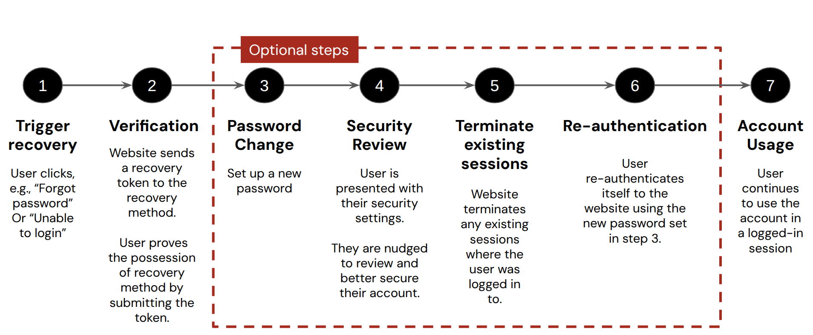

# Test case 4 \- Account recovery using a verified recovery method

## Goal

The goal of this test case is to evaluate the recovery process itself when there is a verified recovery method. There are up to six steps in the account recovery lifecycle:

  
Figure 1: Different steps of an account recovery life cycle

This test case evaluates two different things: the behavior during the account recovery lifecycle itself and the behavior when there are multiple recovery sessions triggered in a short period of time.

## Running the test case

### Actions

1. Use a benign VM  
2. Trigger account recovery

## Testcase 4.1. \- Recovery tests (single session)

### Goal

Evaluate how account recovery is handled during the lifecycle itself.

### Actions

1. Use a benign VM  
2. Trigger account recovery  
3. If a link is used, click the link once and then click the link again to determine if it’s terminated upon click  
   1. If it’s terminated upon click, make a note, if not, continue with the password change/successful account recovery   
4. Click on the link again to see if it’s terminated upon use

### Questions

| Test case number | Question | Answer type |
| :---- | :---- | :---- |
| 4.1.1 | How is the account recovery triggered? | Reset link OTP Phone call Both OTP and convenience reset link Temporary password sent to email |
| 4.1.2 | What is the text of the message sent when recovery is triggered? | Free text |
| 4.1.3 | Is the validity clearly conveyed to the user?*Note: remember to check in the recovery email or browser window for this information.* | Yes, in the recovery email Yes, in browser window No  |
| 4.1.3.1 | How long is the link/OTP/password valid for?  *(optional, only if the answer to 4.1.3 was Yes)* | Free text |
| 4.1.3.2 | Test that the link is invalid after the validity window. Is it invalidated? *(optional, only if the answer to 4.1.3 was Yes)* | Yes No  |
| 4.1.3.3 | *(optional, only if the answer to 4.1.3 was No)*  If no, test whether the link/OTP is valid at irregular intervals: 5m, 10m, 30m, 1h, 3h, 12h, 24h. What is the interval of validity of the link/OTP?         | Free text |
| 4.1.4 | What can we do during the password reset process? | `skip` \= skip setting a new password `old` \= explicitly set our old password `new` \= set up a new password  |
| 4.1.5 | On what condition is the validity of the link/OTP terminated? | Upon click/use of OTP Upon completion of a recovery process  |
| 4.1.6 | Is the validity of the convenience link terminated if we manually use the OTP? *(optional, only if the the recovery trigger 4.1.1 was both an OTP and a convenience link)* | Yes No  |
| 4.1.7 | Is the validity of a code terminated after it is used. *(optional, only if the the backup/recovery codes were generated during account creation, testcase 1.2.5)* | Yes No |
| 4.1.8 | Does the user receive an alert about the account recovery? | Yes No |
| 4.1.9 | When is an alert received? | Multiple choice: During recovery triggering  After multiple failed attempts (or suspicious activities) On an unsuccessful recovery On a successful password change On a successful recovery if the password is not changed Other: \_\_\_\_\_ |

## Test case 4.2 \- Post recovery behavior

### Goal

The goal of this test case is to evaluate what happens after a successful recovery. Additionally, we test what happens when a user tries to log in with an old password.

### Actions

1. Use a benign VM  
2. Trigger account recovery 3 times (if possible):  
   1. Skipping the password change  
   2. Using the old password as the new password  
   3. Using a new password  
3. Answer to all the questions in this section after each type of recovery.  
4. Try to log in to the account using old credentials to authenticate.

### Questions

| Test case number | Question | Answer type |
| :---- | :---- | :---- |
| 4.2.1 | What happens immediately after a successful recovery? | The user is automatically authenticated into a new session The user is required to re-authenticate The user is taken to a security settings review Other: \_\_\_\_ |
| 4.2.2 | Does the service prompt the user to review their security settings after a recovery? | Yes, directly after changing the password Yes, on the first login after resetting the password Yes, other: \_\_\_\_ No |
| 4.2.3 | What kind of security settings review is offered to the user?For example:  A **guided process** to provide a summary review of the settings plus "secure an account" where the service provider recommends tips or best practices for the settings they are asked to review An **unguided process** where the settings are just shown with no help on how to set them.  A **semi-guided process** is when a subset of the security settings are shown to the user but no tips/best practices or highlights on those are given | Guided process Unguided process Semi-guided process N/A  |
| 4.2.4 | What security settings are reviewed? | Free text |
| 4.2.5 | If it’s a guided process (4.2.3), make notes about the guidance | Free text |
| 4.2.6 | What happens when we attempt to log in with an old password? | Not allowed to log in (prompt says it’s a wrong password) Not allowed to log in (and the prompt indicates that the password has been changed recently) Allowed to log in (within a reasonable time window)  |
| 4.2.7 | What information about the password change is given to the user? Note: the goal here is to find potential information leaks (whether the service just says it’s an incorrect password, if it says that it’s an old password or if it lets the user know how recently the password has changed) | Free text |

## Test case 4.3 \- Recovery tests (multiple recovery sessions)

### Goal

Check what happens when multiple recovery sessions are triggered within a single validity window and determine if there may be any problems with validity of recovery triggers and their termination.

### Actions

1. Use a benign VM  
2. Trigger account recovery once  
3. Trigger account recovery a second time immediately afterwards  
4. Try to use the recovery link/OTP from the first recovery session triggered in step 1 and note whether it can still be used or not.

### Questions

| Test case number | Question | Answer type |
| :---- | :---- | :---- |
| 4.3.1 | Is the new link/OTP the same as the first one? | Yes No  |
| ~~4.3.2~~ | ~~If the link is the same, does it extend the validity winddow?~~ |  |
| 4.3.2 | If the new link/OTP is different from the first one, what happens to the first link/OTP? | It is still valid It is invalidated/terminated |

## Test case 4 \- Wrap-up

After this test case, move to test case 5